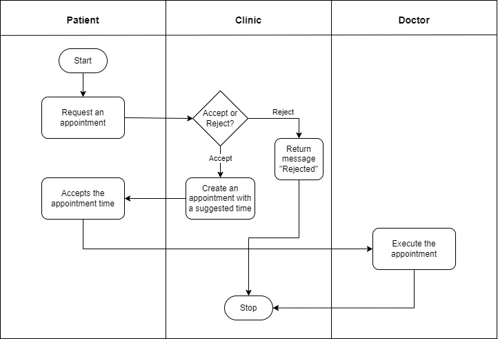

# Daml Clinic App

## Overview

This DAML project was designed for a Health Care Clinic scenario. The patient can request an appointment to the clinic. The clinic can accept the request and suggests an appointment time or reject the appointment request. Finally, when the patient accepts the appointment time, the doctor can execute the appointment.

## Workflow



1. The patient request an appointment to the clinic (non-consuming choice _CreateRequest_)
2. The clinic Accept the request and create an appointment with a suggested time (consuming choice _AcceptRequest_)
3. The patient accepts the appointment (consuming choice _AcceptAppointment_)
4. The doctor execute the appointment (consuming choice _ExecuteAppointment_)

- The clinic has the choice to reject the request (consuming choice _RejectRequest_)
- The clinic can also check the appointments (non-consuming choice _CheckAppointments_)

## Compiling & Testing

To compile and test, run the pre-written script in the _`MyTests.daml`_ under /daml OR run:
```
$ daml start
```